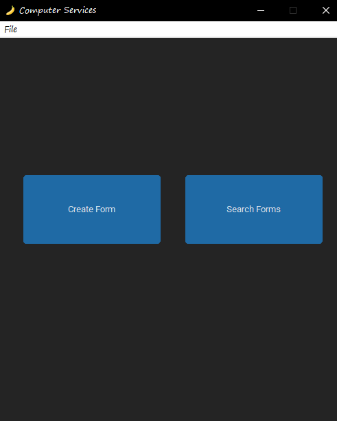
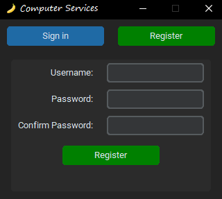
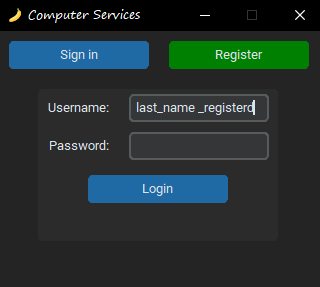

<h1 align="center">
    <a href=""> HelpDesk Contract Form Creator</a>
</h1>

<p align="center">
  <i align="center">
    this project is for help desk and computer repair mans 🚀</i>
</p>

<div align="center">

  

</div>

## Introduction
During my internship in a helpdesk position, I noticed that repair technicians needed a software solution to easily create contract forms while saving the date and time automatically. This inspired me to start a project using Python and the custom-tkinter library to develop a simple and efficient software tool. The result is a user-friendly application that meets these needs. I hope you enjoy it! :)


<details open>
<summary>
 Features
</summary> <br />


<table>
  <tr>
    <td></td>
    <td rowspan="3"></td>
    <td rowspan="3"></td>
  </tr>
  <tr>
    <td></td>
  </tr>
  <tr>
    <td></td>
  </tr>
</table>
    
</details>

## Installation
1. Follow the steps below to install app perfectly:
```shell
 > git clone https://github.com/Amirhoseindzh/Computer_Services_Repair_Form

 > pip install requirements.txt

 > python3 main.py
```


## Resources

- **[YouTube](https://www.youtube.com/)** for guides.
- **[Google](https://www.google.com/)** for guides.
- **[Github](https://www.github.com/)** for guides.
- Chatgpt for guides.

<a name="contributing_anchor"></a>
## Contributing

Help-Desk Contract Form is an open-source project. I committed to a fully transparent development process and highly appreciate any contributions. Whether you are helping me fix bugs, proposing new features, improving my documentation or spreading the word - we would love to have you as a part of the Airline-booking community. 

- Bug Report: If you see an error message or encounter an issue while using Amplication, please create a [bug report](https://github.com/Amirhoseindzh/Airline-Booking/issues/2#issue-2271571036).


## License

A large part of this project is licensed under the [Apache 2.0](./LICENSE) license. 
